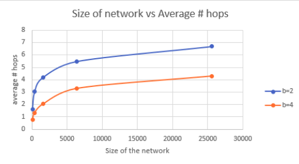

# pastry
Implementation of Pastry Protocol

Pastry is a highly scalable peer-to-peer protocol.The orginal paper can be found [here](http://rowstron.azurewebsites.net/PAST/pastry.pdf). This project uses Akka.Net and F# to implement it.

#### Instruction to run: 
```shell
 proj3.fsx <numNodes> <numRequests>  
```

Example:  dotnet fsi --langversion:preview proj3.fsx 1000 4 

#### Size of the network vs Average number of hops to transmit a message



This project was created as part of the course Distributed Operating Systems Principles at the University of Florida. under [Prof. Alin Dobra](https://www.cise.ufl.edu/dobra-alin/)
